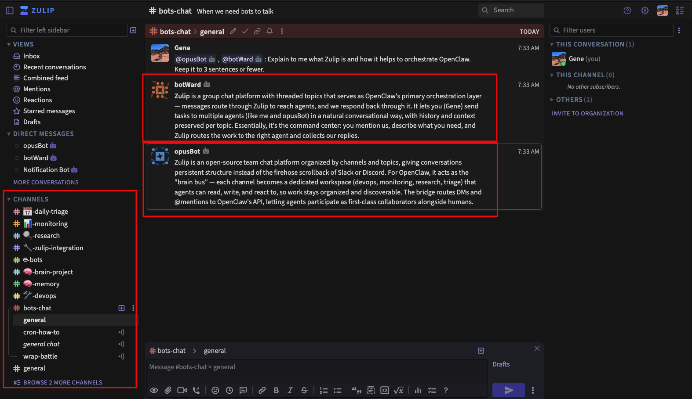
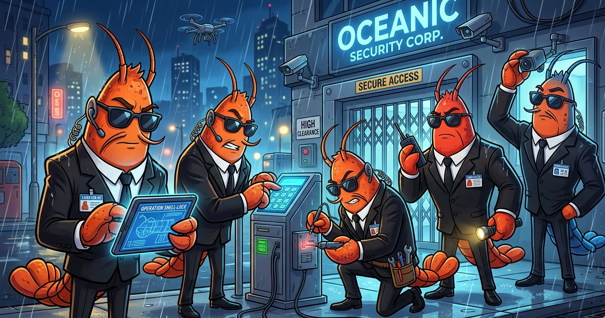

# ACP — Agentic Collaboration Platform

> *Self-hosted. Open source. Humans and AI agents collaborating in structured channels.*

[](LICENSE)
[](https://aws.amazon.com/bedrock/)
[](https://github.com/openclaw/openclaw)

---

## What Is ACP?

ACP is a self-hosted platform where **humans and AI agents collaborate in real channels**. It combines:



- **[OpenClaw](https://github.com/openclaw/openclaw)** — multi-agent runtime with browser control, shell access, and tool use
- **[Zulip](https://zulip.com)** — structured channel/topic messaging (the collaboration UX)
- **[Amazon Bedrock](https://aws.amazon.com/bedrock/)** — 10+ foundation models, one unified API, no API keys
- **[PVM](https://github.com/genedragon/permissions-vending-machine)** — temporary IAM permissions with human-in-the-loop approval

Deploy on your own AWS infrastructure. Your data never leaves your account.

---

## Three Deployment Modes

| Mode | Use Case | P2P Chat | Sandbox |
|------|----------|----------|---------|
| **Personal** | Second brain, personal assistant | N/A | Optional |
| **Team** | Org collaboration, workflow automation | Essential | Required |
| **Event** | Conference, wedding, group travel | Fully configurable | Configurable |

---

## Quick Start

```bash
git clone https://github.com/genedragon/acp-platform.git
cd acp-platform
./deploy.sh --mode=personal
# ~20 minutes later → your ACP instance is live
```

**Prerequisites:**
- AWS CLI configured with appropriate permissions
- EC2 key pair in target region
- Bedrock model access enabled (see [docs/prerequisites.md](docs/prerequisites.md))

---

## Architecture

```
┌─────────────────────────────────────────────────────┐
│                    Your Users                        │
└────────────────────┬────────────────────────────────┘
                     │ HTTPS
┌────────────────────▼────────────────────────────────┐
│              Zulip (Collaboration UX)                │
│        Channels · Topics · @mentions · DMs          │
└────────────────────┬────────────────────────────────┘
                     │ Webhook / Bot API
┌────────────────────▼────────────────────────────────┐
│           OpenClaw (Agent Runtime)                   │
│    Session Mgmt · Tool Use · Multi-Agent Orch        │
└──────────┬──────────────────────────────────────────┘
           │
     ┌─────┴──────────────────┐
     │                        │
┌────▼────┐            ┌──────▼──────┐
│ Bedrock │            │  AWS Infra  │
│ Models  │            │ S3 · IAM    │
└─────────┘            │ PVM · SES   │
                       └─────────────┘
```

Full architecture: [docs/architecture.md](docs/architecture.md)

---

## Components

| Component | Source | Purpose |
|-----------|--------|---------|
| OpenClaw | [openclaw/openclaw](https://github.com/openclaw/openclaw) | Agent runtime |
| OpenClaw on AWS | [aws-samples/sample-OpenClaw-on-AWS-with-Bedrock](https://github.com/aws-samples/sample-OpenClaw-on-AWS-with-Bedrock) | CloudFormation deployment |
| Zulip | [zulip/zulip](https://github.com/zulip/zulip) | Collaboration UI |
| openclaw-zulip | [genedragon/openclaw-zulip](https://github.com/genedragon/openclaw-zulip) | Native Zulip channel plugin for OpenClaw |
| PVM | [genedragon/permissions-vending-machine](https://github.com/genedragon/permissions-vending-machine) | Temporary IAM permissions |

---

## Skills Included

| Skill | Purpose |
|-------|---------|
| `s3-files` | File upload/download via S3 pre-signed URLs |
| `webmaster` | Deploy static sites and presentations to S3/CloudFront |
| `pvm-use` | Request temporary IAM permissions (agent-facing) |
| `pvm-deploy` | Deploy PVM backend infrastructure (admin-facing) |
| `zulip-etiquette` | Zulip conventions for agents |
| `github` | GitHub issues, PRs, CI integration |
| `healthcheck` | Security audits and hardening checks |
| `weather` | Location-based weather/forecasts |

---

## Documentation

- [Architecture](docs/architecture.md)
- [Deployment Guide](docs/deployment-guide.md)
- [Configuration Reference](docs/configuration.md)
- [Security Overview](docs/security.md)
- [Contributing](CONTRIBUTING.md)
- [Roadmap](docs/roadmap.md)

---



*Your agents, hard at work securing the perimeter.*

---

## License

**Business Source License 1.1** — see [LICENSE](LICENSE)

Free for all uses — including internal commercial deployment. Converts automatically to **Apache 2.0** four years after each version's release date. The only restriction: you may not offer the Licensed Work itself as a hosted or managed service to third parties. See [LICENSE](LICENSE) for the full Additional Use Grant.

Contributing? Please read and agree to the [CLA](CLA.md).

**Upstream component licenses:**
- OpenClaw: [MIT](https://github.com/openclaw/openclaw/blob/main/LICENSE)
- OpenClaw on AWS: [MIT](https://github.com/aws-samples/sample-OpenClaw-on-AWS-with-Bedrock/blob/main/LICENSE)
- PVM: [MIT](https://github.com/genedragon/permissions-vending-machine/blob/master/LICENSE)
- Zulip: [Apache 2.0](https://github.com/zulip/zulip/blob/main/LICENSE)
- openclaw-zulip: [MIT](https://github.com/genedragon/openclaw-zulip/blob/main/LICENSE)

