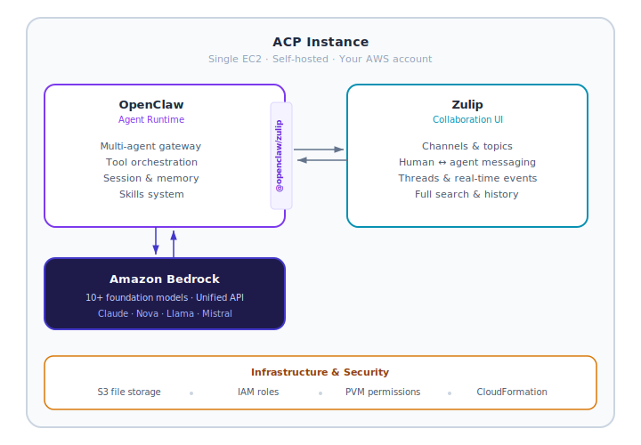

# ACP — Agentic Collaboration Platform

> *Self-hosted. Open source. Humans and AI agents collaborating in structured channels.*

[](LICENSE)
[](https://aws.amazon.com/bedrock/)
[](https://github.com/openclaw/openclaw)

---

## What Is ACP?

ACP is a self-hosted platform where **humans and AI agents collaborate in real channels**. It combines:


- **[OpenClaw](https://github.com/openclaw/openclaw)** — multi-agent runtime with gateway, session controls, and tool use
- **[Zulip](https://zulip.com)** — structured channel/topic messaging (the collaboration UX)
- **[Amazon Bedrock](https://aws.amazon.com/bedrock/)** — 10+ foundation models, one unified API, no API keys
- **[PVM](https://github.com/genedragon/permissions-vending-machine)** — temporary IAM permissions with human-in-the-loop approval
- **[acp-brain](https://github.com/genedragon/acp-brain)** — persistent AI memory layer with semantic search, provenance tracking, and Safe Agent Memory Contract

Deploy on your own AWS infrastructure. Your data never leaves your account.

---

## Quick Start

```bash
git clone https://github.com/genedragon/acp-platform.git
cd acp-platform
./deploy.sh --mode=personal --key-pair=YOUR_KEY_PAIR_NAME
# ~20 minutes later → your ACP instance is live
```

**Prerequisites:**
- An AWS account with appropriate permissions
- EC2 key pair in target region
- Bedrock model access enabled (see [Bedrock Auth Guide](docs/bedrock-auth.md))

For the full walkthrough, see the [Deployment Guide](docs/deployment-guide.md) — a 9-phase guide with checkpoints, rollback, and troubleshooting. A coding agent (Kiro, Claude Code) can follow it step-by-step.

> **Pinned versions:** All scripts read from [`versions.env`](versions.env). Update that file when upgrading dependencies.

---

## Agent-Assisted Deployment (Easy Mode)

Don't want to run commands yourself? Let a coding agent deploy ACP for you.

### Prerequisites

- An AWS account with appropriate permissions
- Bedrock model access enabled (see [Bedrock Auth Guide](docs/bedrock-auth.md))

### Steps

1. **Install a coding agent** — Deployment has been tested end-to-end using the free tier of [Kiro](https://kiro.dev), but any agent that can run terminal commands works (Claude Code, Cursor, etc.)

2. **Configure AWS CLI access:**
   ```bash
   aws sso login --profile <your-profile>
   # or
   aws configure
   ```
   Confirm access: `aws sts get-caller-identity`

3. **Give your agent these instructions:**

   > Clone and deploy ACP to my AWS account. Follow the README and deployment guide at https://github.com/genedragon/acp-platform — use `./deploy.sh --mode=personal --key-pair=MY_KEY_PAIR` for the happy path, or follow the full deployment guide for custom configuration.

The agent will handle cloning, dependency installation, CloudFormation bootstrapping, and deployment. Sit back and let it work. 🚀

---

## Architecture

Full architecture: [docs/architecture.md](docs/architecture.md)



---

## Agents

ACP is designed for **multi-agent collaboration** — deploy specialized agents that work alongside humans in Zulip channels. Each agent has its own identity, model, skills, and workspace.

### Included Agents

| Agent | Role | Model | Infrastructure |
|-------|------|-------|---------------|
| [**sysAdmin**](agents/sysadmin/) | System ops, health monitoring, Zulip admin, security audits | Haiku (fast) | Local permissions only — no extra AWS resources |
| [**webmaster**](agents/webmaster/) | Static site deployment, S3/CloudFront management | Haiku (fast) | S3 bucket + CloudFront (CloudFormation included) |

### Adding an Agent (post-deploy)

After your ACP instance is running (Phases 0–8 in the [Deployment Guide](docs/deployment-guide.md)):

1. Pick an agent from `agents/` (or use `agents/_template/` to create your own)
2. Follow its `README.md` for setup — create a Zulip bot, merge the config, install skills
3. Restart the gateway — the new agent starts responding

Each agent directory contains:
- `IDENTITY.md` — persona and system prompt
- `agent-config.json` — OpenClaw config snippet to merge into `openclaw.json`
- `README.md` — full setup guide with permissions and infrastructure requirements
- `infra/` (optional) — CloudFormation for agent-specific AWS resources

See [agents/README.md](agents/) for full details on the agent packaging system.

---

## Components

| Component | Source | Purpose |
|-----------|--------|---------|
| OpenClaw | [openclaw/openclaw](https://github.com/openclaw/openclaw) | Agent runtime |
| OpenClaw on AWS | [aws-samples/sample-OpenClaw-on-AWS-with-Bedrock](https://github.com/aws-samples/sample-OpenClaw-on-AWS-with-Bedrock) | CloudFormation deployment |
| Zulip | [zulip/zulip](https://github.com/zulip/zulip) | Collaboration UI |
| openclaw-zulip | [genedragon/openclaw-zulip](https://github.com/genedragon/openclaw-zulip) | Native Zulip channel plugin for OpenClaw |
| PVM | [genedragon/permissions-vending-machine](https://github.com/genedragon/permissions-vending-machine) | Temporary IAM permissions |
| acp-brain | [genedragon/acp-brain](https://github.com/genedragon/acp-brain) | Persistent AI memory layer (MCP server) |

---

## Skills Included

| Skill | Purpose |
|-------|---------|
| `s3-files` | File upload/download via S3 pre-signed URLs |
| `webmaster` | Deploy static sites and presentations to S3/CloudFront |
| `pvm-use` | Request temporary IAM permissions (agent-facing) |
| `pvm-deploy` | Deploy PVM backend infrastructure (admin-facing) |
| `zulip-etiquette` | Zulip conventions for agents |
| `github` | GitHub issues, PRs, CI integration |
| `healthcheck` | Security audits and hardening checks |
| `weather` | Location-based weather/forecasts |

---

## Documentation

| Guide | What It Covers |
|-------|---------------|
| [**Deployment Guide**](docs/deployment-guide.md) | Full 9-phase walkthrough with checkpoints — the main reference |
| [**Bedrock Auth**](docs/bedrock-auth.md) | Model access setup, EC2 credential config, auth chain troubleshooting |
| [**DNS & SSL**](docs/dns-and-ssl.md) | Domain setup, Cloudflare, Let's Encrypt, port 80 gotcha |
| [**User Management**](docs/user-management.md) | Managing users without outgoing mail (Django scripts) |
| [**Upgrade Guide**](docs/upgrade-guide.md) | OpenClaw version upgrades with rollback |
| [**Troubleshooting**](docs/troubleshooting.md) | 13 deployment rules, per-phase diagnosis, common errors |
| [Architecture](docs/architecture.md) | System architecture and data flow |
| [Configuration](docs/configuration.md) | OpenClaw and Zulip config reference |
| [**Agents**](agents/) | Pre-built agent identities and how to create your own |
| [Security](docs/security.md) | Security model and hardening |
| [Roadmap](docs/roadmap.md) | Project roadmap |
| [Contributing](CONTRIBUTING.md) | Contribution guidelines |

---


*Your agents, hard at work securing the perimeter.*

---

## License

**Business Source License 1.1** — see [LICENSE](LICENSE)

Free for all uses — including internal commercial deployment. Converts automatically to **Apache 2.0** four years after each version's release date. The only restriction: you may not offer the Licensed Work itself as a hosted or managed service to third parties. See [LICENSE](LICENSE) for the full Additional Use Grant.

Contributing? Please read and agree to the [CLA](CLA.md).

**Upstream component licenses:**
- OpenClaw: [MIT](https://github.com/openclaw/openclaw/blob/main/LICENSE)
- OpenClaw on AWS: [MIT](https://github.com/aws-samples/sample-OpenClaw-on-AWS-with-Bedrock/blob/main/LICENSE)
- PVM: [MIT](https://github.com/genedragon/permissions-vending-machine/blob/master/LICENSE)
- Zulip: [Apache 2.0](https://github.com/zulip/zulip/blob/main/LICENSE)
- openclaw-zulip: [MIT](https://github.com/genedragon/openclaw-zulip/blob/main/LICENSE)
